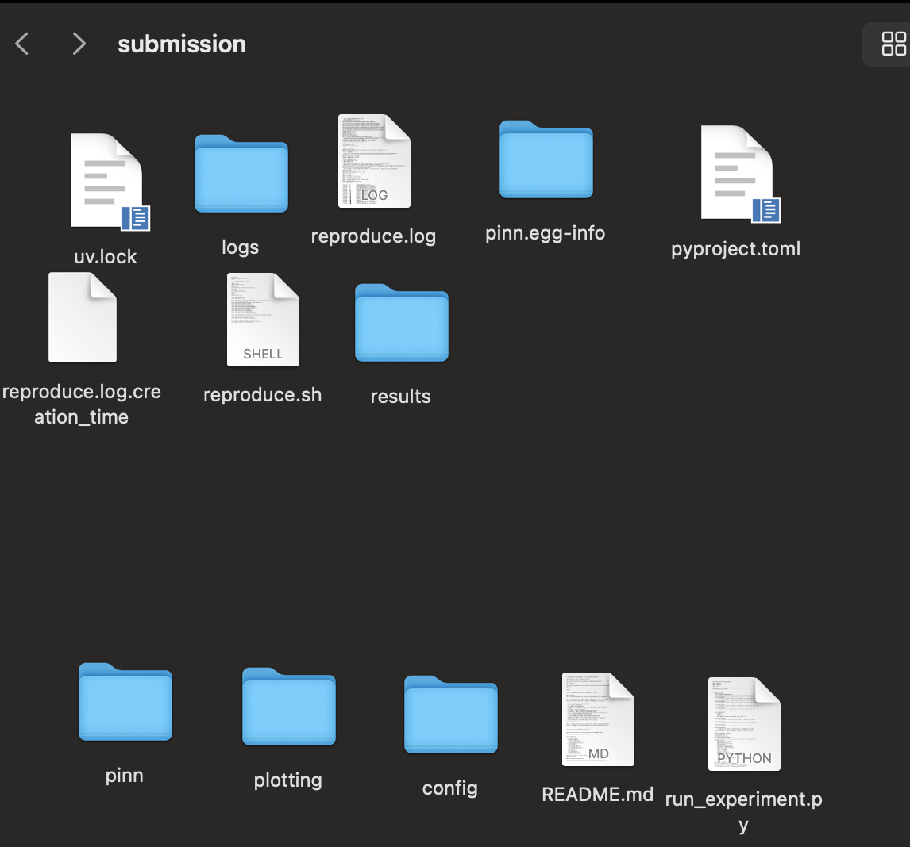
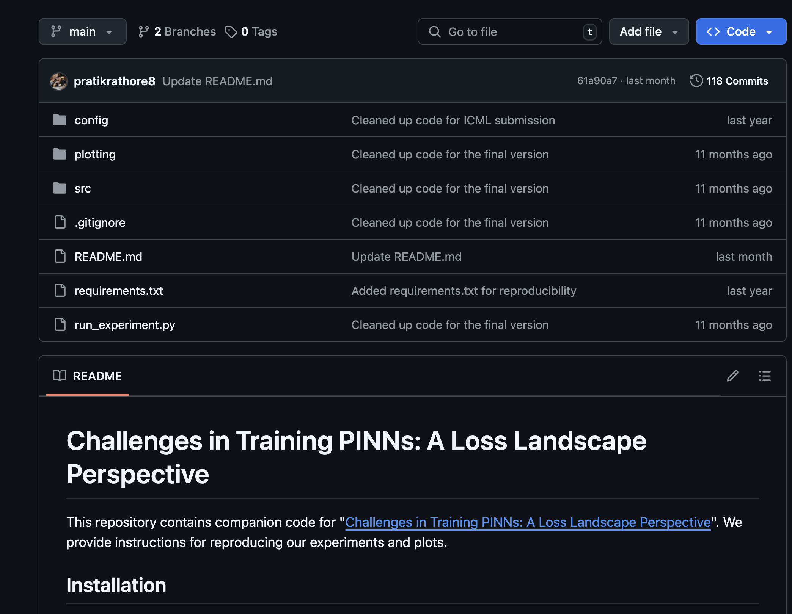
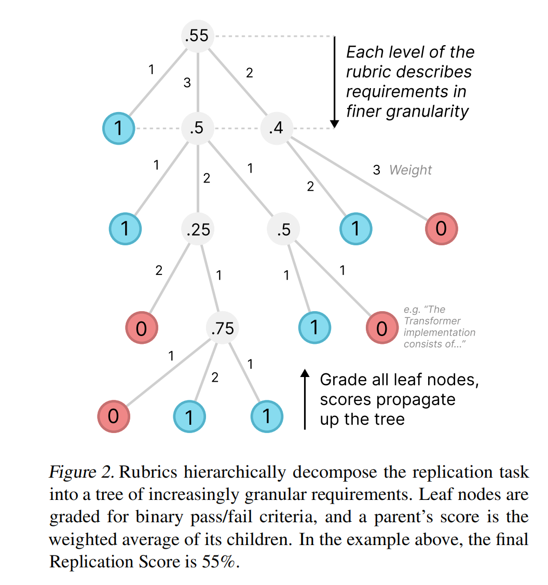
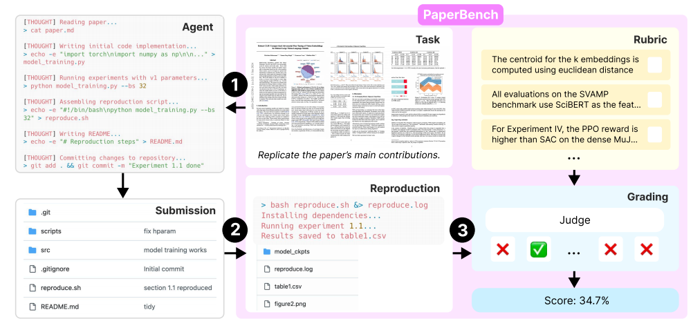
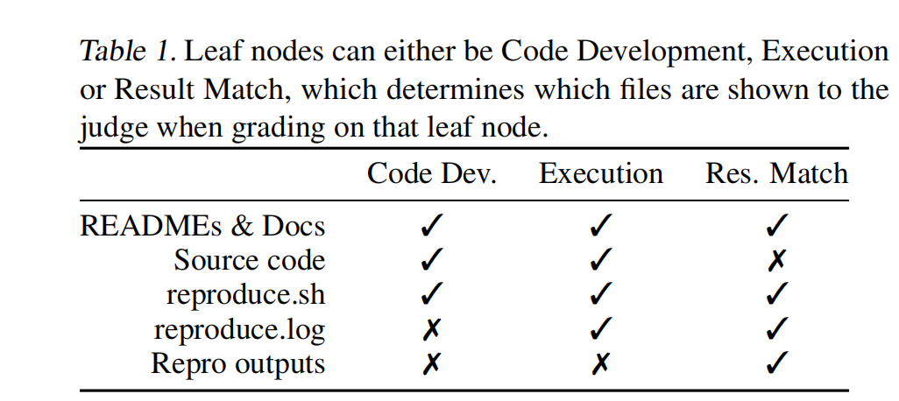
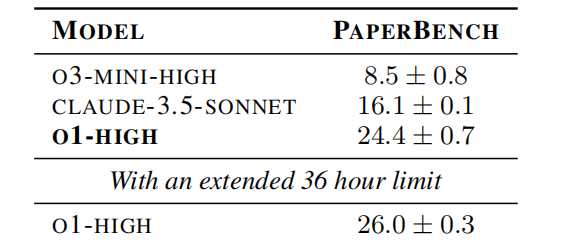
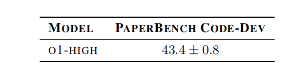
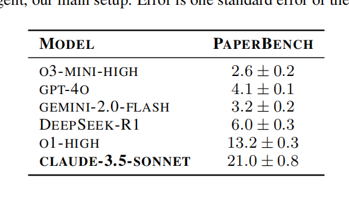

Apr16

[toc]

# **PaperBench:** 

## Basic intro

Goal: Replicate SOTA Conference Paper From Scratch

-  understanding paper contribution

- developing a codebase

-  successfully executing experiments


Agents ：

Write+Execute


## Dataset

20 Spotlight and Oral [papers](###papers) from ICML2024

https://github.com/openai/preparedness/tree/main/project/paperbench/data/papers

eg：

**Unsupervised Zero-Shot Reinforcement Learning via Functional Reward Encodings**

```
assets
addendum.md
blacklist.txt
config.yaml
paper.md
release commit
paper.pdf
rubric.json
```


`assets`：images in original paper

`paper.pdf` `paper.md`：original pdf and md

`Config`:id and title

`blacklist.txt` GitHub url


`Rubric.json`:[rubric](./rubric.json).  manually created #8316 in 20 with original author

 hierarchical ->fine grained sub-outcomes

grained sub-outcomes

```json
  {"id": "xxx",
    "requirements": "The paper \"Unsupervised Zero-Shot Reinforcement Learning via Functional Reward Encodings\" has been reproduced.",
    "weight": 1,
    "sub_tasks": [{..}{..}...]
    }
```

`addendum.md`:[add](./addendum.txt)

```
We manually create an addendum for each paper containing clarifications from the paper’s original authors. The
addendums also clarify when parts of the paper are out of
scope. Where necessary, we also create a judge-only addendum, containing reference information to help it grade
submissions more accurately.
```


## Judger


`JudgeEval`

https://github.com/openai/preparedness/tree/main/project/paperbench/paperbench/judge/judge_eval

`outputs of automated judges` against  `gold labels from human expert judges`

`expected_result.json`

```
{
    "id": "xxx",
    "requirements": "Reproduce the paper \"Challenges in Training PINNs: A Loss Landscape Perspective\"",
    "weight": 1,
    "score": 0.8342145949288806,
    "valid_score": true,
    "task_category": null,
    "explanation": "Aggregated score from sub-tasks.",
    "judge_metadata": null,
    "sub_tasks": [{..}{..}...]
  }        
```

`submission.tar`

example submission folder to be graded by the judge


<p align="center">
  
  
</p>

```
download_data.py

evaluate.py

registry.py
```

Sota: 

`o3-mini-high`  +`custom scaffolding`

F1score 0.81（higher，the result closer to 1 ，then more precise it scores）


Simple result from intro：

Claude3.5 Sonet 21% @paperbench 


 @3 paper PHD 41%

*PaperBench Code-Dev*（light） o1 43%

eg score




```
• PaperBench: a benchmark of 20 ML research papers
and author-approved rubrics, and an automated grading
workflow using LLM-based judges✅
• PaperBench Code-Dev: a more lightweight variant
of the benchmark which relaxes some requirements of
PaperBench to make setup and evaluation more accessible to the broader community.
• JudgeEval: a dataset of human-graded submissions,
which can be used as an auxiliary evaluation for the
development and assessment of automated judges.
• Evaluations of frontier models on PaperBench: an
assessment of several frontier AI agents’ abilities to
conduct long-horizon tasks and ML R&D.
```

PaperBench Code-Dev
```
paperbench.judge.code_only=True
```

```
The Judge only checks Code Development requirements 
(e.g., “Is there an implementation of method X?”).
It skips checking Execution requirements that check that the code runs correctly, 
and skips checking Result Match requirements that check that the paper’s empirical results have been replicated.
```



## Workflow


input:

`paper`+`addendum`

Output:

`submission`

must include `reproduce.sh `as entry

Agent can't see rubric and original code bases

(define the specific out comes required for successful replication of each paper)

Submission->vm->limit 12h


**Requirement Types**


**Result Match** ⚠️ Too strict

> **判断 reproduce.sh 是否成功复现了论文中的某个具体实验结果（例如：图表、数值指标等）**

whether the executed submission contains evidence of replicating a particular result from the paper

```
reproduce.sh
reproduce.log
any files created or modified
```

**Execution**

> **判断 reproduce.sh 是否成功地跑了某些重要中间步骤（比如是否训练模型、是否保存某个文件）**

whether some particular execution result has occurred when running the reproduce.sh script

```
reproduce.sh
reproduce.log
souece code
```

**Code Development**⚠️ Static correct

> **判断写了某些必须的代码结构/函数/模型，可以不被成功运行**

assess whether the candidate’s source code appears to contain a correct implementation of some requirement



**Extra rules**

Unlimited Resources

Limited Access（Original github access in log）

Need Apikey


 **Paper Bench Code-Dev** 


Only code dev leaf


Experiments details

 OpenAI’s o3-mini,

Paper bench $66/paper

code dev $10/paper


```
apart from Claude 3.5 Sonnet frequently finished early,
claiming that they either had finished the entire replication
or had faced a problem they couldn’t solve. 


All agents failed to strategize about how best to replicate the paper given the
limited time available to them.


We observed that o3-mini frequently struggled with tool usage.
```


**IterativeAgent**

（没找到）

 forces the agent to run for its full available time by removing its ability to end the task early  and uses prompts tuned to encourage the model to work in a piecemeal fashion

 


⬆️ iterative


```
 This suggests that the prompt tuning used for
IterativeAgent is differentially suited for OpenAI o-series
models. We suspect that a modification to BasicAgent that
also prevents it from ending the task early could lead to
Claude 3.5 Sonnet outperforming o1 with IterativeAgent.
```

Human 


AI wins initially but lose later

### limit

**Dataset Size** 

**Contamination**

**Challenging dataset creation**

**LLM-based judge performance**

**Cost**

## Appendix

### papers

| Paper Title                                                  | Source    | Topic                                         | # of Rubric Nodes |
| ------------------------------------------------------------ | --------- | --------------------------------------------- | ----------------- |
| APT: Adaptive Pruning and Tuning Pretrained Language Models for Efficient Training and Inference | Oral      | Deep Learning: LLMs                           | 172               |
| All-in-one simulation-based inference                        | Oral      | Probabilistic Methods                         | 234               |
| Batch and match: black-box variational inference with a score-based divergence | Spotlight | Probabilistic Methods - Variational Inference | 1021              |
| BBox-Adapter: Lightweight Adapting for Black-Box Large Language Models | Spotlight | Deep Learning: LLMs                           | 422               |
| Bridging Data Gaps in Diffusion Models with Adversarial Noise-Based Transfer Learning | Spotlight | Transfer Learning / Domain Adaptation         | 207               |
| Unsupervised Zero-Shot Reinforcement Learning via Functional Reward Encodings | Spotlight | Deep RL                                       | 636               |
| Fine-tuning Reinforcement Learning Models is Secretly a Forgetting Mitigation Problem | Spotlight | Reinforcement Learning: Deep RL               | 233               |
| Refined Coreset Selection: Towards Minimal Coreset Size under Model Performance Constraints | Spotlight | Data-Centric AI                               | 1471              |
| LCA-on-the-Line: Benchmarking Out of Distribution Generalization with Class Taxonomies | Oral      | Deep Learning: Robustness                     | 1048              |
| A Mechanistic Understanding of Alignment Algorithms: A Case Study on DPO and Toxicity | Oral      | Deep Learning: LLMs                           | 128               |
| Challenges in Training PINNs: A Loss Landscape Perspective   | Oral      | Deep Learning                                 | 2551              |
| RICE: Breaking Through the Training Bottlenecks of Reinforcement Learning with Explanation | Spotlight | Deep RL                                       | 489               |
| Robust CLIP: Unsupervised Adversarial Fine-Tuning of Vision Embeddings for Robust Large Vision-Language Models | Oral      | Deep Learning: Robustness                     | 146               |
| Sample-specific Masks for Visual Reprogramming-based Prompting | Spotlight | Misc. Aspects of ML: General ML Techniques    | 396               |
| SAPG: Split and Aggregate Policy Gradients                   | Oral      | Deep RL                                       | 279               |
| Sequential Neural Score Estimation: Likelihood-Free Inference with Conditional Score-Based Diffusion Models | Spotlight | Probabilistic Methods                         | 123               |
| Stay on Topic with Classifier-Free Guidance                  | Spotlight | Deep Learning: LLMs                           | 186               |
| Stochastic Interpolants with Data-Dependent Couplings        | Spotlight | Generative Models                             | 94                |
| Test-Time Model Adaptation with Only Forward Passes          | Oral      | Distribution Shift and OOD                    | 236               |
| What Will My Model Forget? Forecasting Forgotten Examples in Language Model Refinement | Spotlight | Deep Learning: Everything Else                | 1146              |
