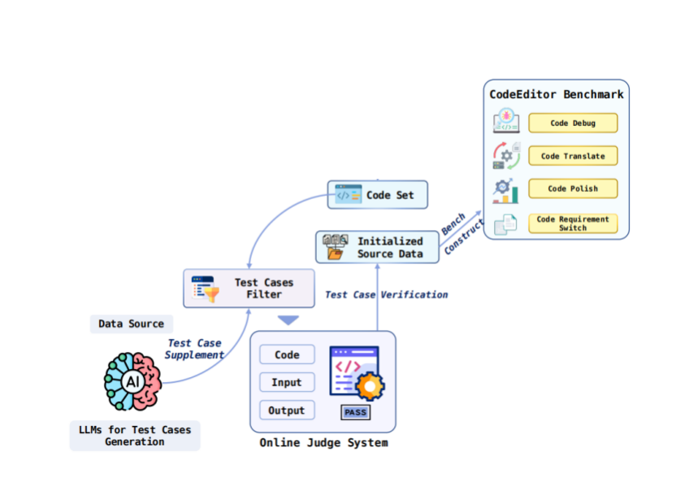
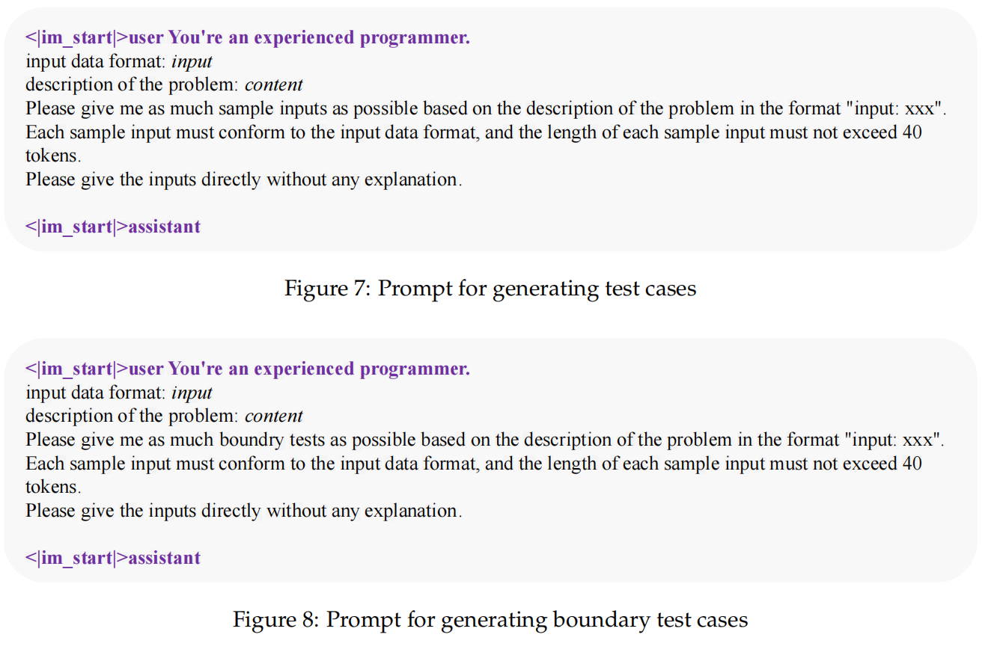
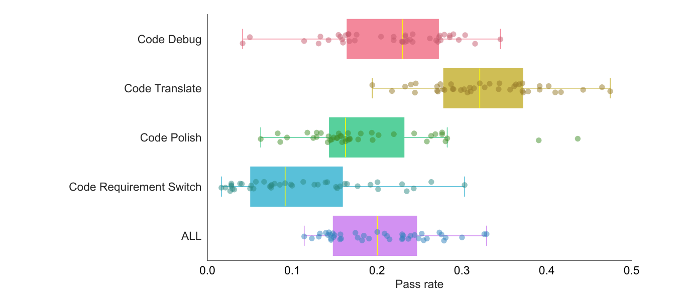
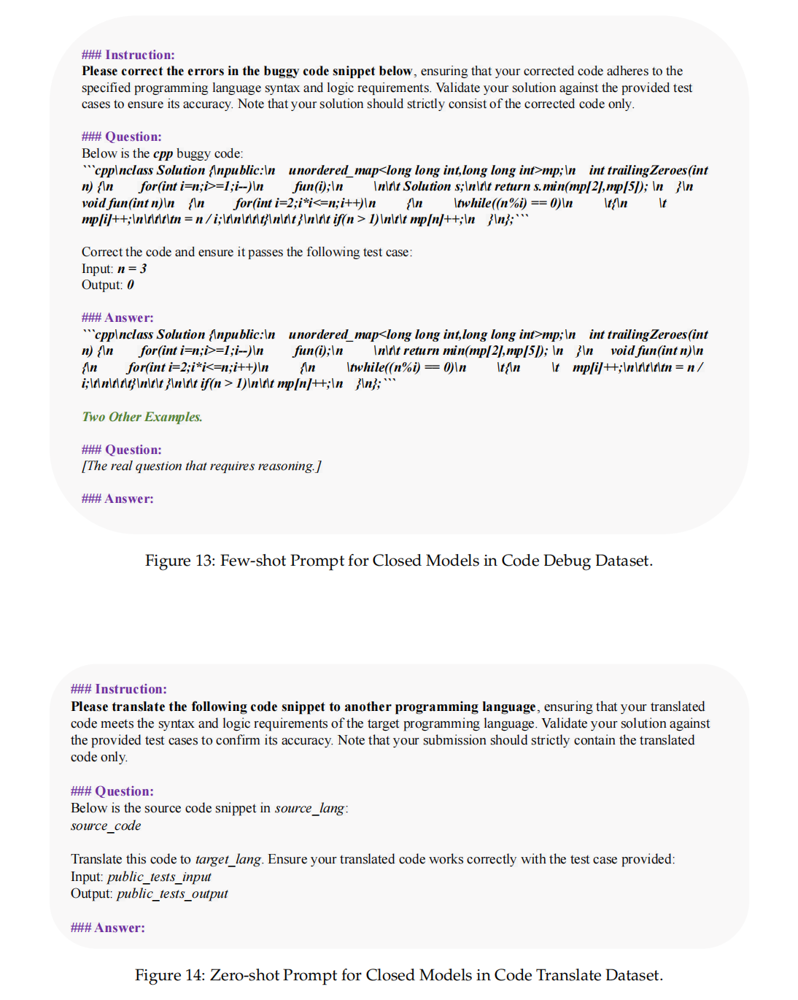

Process by Apr4

[toc]

For default ,i run`llama-3.1-8B-Instruct`on `vllm`

For most cases, figured out how to switch to open/claude api or other open sources models

Only havent figure out the easist way to switch `SWE-agent` from ollam to `vllm`


### **Code Editor Bench**

paper https://arxiv.org/pdf/2404.03543

code https://github.com/CodeEditorBench/CodeEditorBench

**baseline methods**

Test cases set $R_i$

Actual output set $a_c$


**correctness** 

defined as $\forall n,y_n =a_{c_i}(x_n)$    (All Correct,AC)

**subtask**

1. **Debug**


For c: $\exist n,y_n \neq a_{c}(x_n)$    (not AC)

For $c*$ $\forall n,y_n =a_{c^*}(x_n)$   (AC)


2. **Translator**


For c: $\forall n,y_n =a_{c}(x_n)$   (AC)

For $c*$ $\forall n,y_n =a_{c^*}(x_n)=a_{c}(x_n)$   (from AC to AC,but different language)

3. **polisher**


from AC to AC

Additional:

$avg_{time}(c^*)\leq avg_{time}(c)$   or.   $avg_{memory}(c^*)\leq avg_{memory}(c)$


4. **Requirements Switch**

   

   

   

AC on $R_i$ to AC on $R_i^*$


**Dataset**

https://huggingface.co/datasets/m-a-p/CodeEditorBench/tree/main


**Filter** : not too long 800 lines/1000tokens limit

**dataset topic**

 `data structures`— trees, stacks, queues,arrays, hash tables,and pointers.  

  `algorithms`--dp,sorting,D/BFS ,recursion


**Debug dataset:**

Insert error with LLM

Errtype:


prompt

```markdown
### Instruction: 
Given code: code
Please add error: error name to the above code
Please output the modified code directly
### Answer:
```

[CEBDEBUG](#datasample1)

**Translate &  Polish dataset** 

 stratify the dataset according to code complexity, 

$Easy:Medium:Hard=3:4:1$

sample

[CEBTran](#datasample2)

[CEBDPol](#datasample3)


**SwitchDataset**

Group A  `strong relation`

similar questions provided by Leetcode under a certain question(With clear human feedback)

Group B `weak relation`

collect labels

Cluster the questions based on the number of tags they possess

employ Bertto assess the semantic similarity between the descriptions of two questions

within each category. threshold  0.92.

[CEBSwitch](#datasample4)

Other:Primary-Plus :timestamp filter(exclude outdated data)


**Preprocess**

**Code template construction**

[preprocess](#preprocesstemplate)

**Test cases generation**

used GPT-4, GLM-4, and Qwen-72B-chat to generate inputs. Outputs were validated by running the problem-solving code through an online judge (OJ).



**Experiment**

decoding 

API+**greedy decoding**+pass@1（？some conflict with proposal i think）

vllm+filter（api1024 open2048 800lines）


prompt

llama

```
*<*s*>*[INST] and [/INST] 
```

openai

`*Instruction-Question-Answer* `





few/zero prompt




so on


### HumanEval

for quick set up i use `vllm`+`llama3.1 8b instruct`

sample generate

```json
{"task_id": "HumanEval/0", "completion": "Here's how you can implement the `has_close_elements` function in Python:\n\n```python\nfrom typing import List\n\ndef has_close_elements(numbers: List[float], threshold: float) -> bool:\n    \"\"\"\n    Check if in given list of numbers, are any two numbers closer to each other than given threshold.\n\n    Args:\n    numbers (List[float]): A list of floating point numbers.\n    threshold (float): The minimum distance between two numbers.\n\n    Returns:\n    bool: True if there"}
```

my script on vllm server [sample](#1)

to quick start ,limit sample per task to 2

```
(codex) root@4c048ca8-eefd-4216-bcca-4fdaf9a1bac0-0:~/human-eval# evaluate_functional_correctness samples.jsonl
Reading samples...
328it [00:00, 57453.82it/s]
Running test suites...
100%|██████████████████████████████████████████████████████████████████████████████████| 328/328 [00:01<00:00, 183.57it/s]
Writing results to samples.jsonl_results.jsonl...
100%|████████████████████████████████████████████████████████████████████████████████| 328/328 [00:00<00:00, 65651.72it/s]
{'pass@1': 0.0}
```

Using json they provided

```
(codex) root@4c048ca8-eefd-4216-bcca-4fdaf9a1bac0-0:~/human-eval# evaluate_functional_correctness data/example_samples.jsonl --problem_file=data/example_problem.jsonl
Reading samples...
6it [00:00, 4181.06it/s]
Running test suites...
100%|███████████████████████████████████████████████████████████████████████████████████████| 6/6 [00:03<00:00,  1.99it/s]
Writing results to data/example_samples.jsonl_results.jsonl...
100%|████████████████████████████████████████████████████████████████████████████████████| 6/6 [00:00<00:00, 21940.56it/s]
{'pass@1': 0.4999999999999999}
```


### LLM4Decompile

```c
#include <stdio.h>

int func0(int x, int y) {
    return x + y;
}

int main() {
    int result = func0(5, 3);
    printf("Result: %d\n", result);
    return 0;
}
```

Gcc -o3

```assembly
# This is the assembly code:
<func0>:
endbr64
lea    (%rdi,%rsi,1),%eax
ret
# What is the source code?
```

original

```c
(llm4decompile) root@4c048ca8-eefd-4216-bcca-4fdaf9a1bac0-0:~/LLM4Decompile# python dec.py
Loading checkpoint shards: 100%|██████████████████████████████████████████████████████████████████████████████| 3/3 [00:01<00:00,  2.23it/s]
Setting `pad_token_id` to `eos_token_id`:32014 for open-end generation.
original function:
#include <stdio.h>

int func0(int x, int y) {
    return x + y;
}

int main() {
    int result = func0(5, 3);
    printf("Result: %d\n", result);
    return 0;
}
decompiled function:
int func0(int a, int b)
{
 return a + b;
}
```


### Running `swe-agent`

**Local**

Successfully run through `ollama/llama3.1-8B-Instruct` 

takes a lot of time to setup but can provide some local model results for comparison

[WIP] trying to deploy on vllm but seems to have compatible problems,if following baselines are to run on see-agents,I think figure it out is necessary.Ollma is too slow

**API**

Using `Openai/Claude api` can be easier if possible(dont have key now, but can be setup quickly)


Best result comes from gpt4o so maybe trying it after got some api-keys


# Appendix

### datasample1


```json
{
  "idx": 1330,
  "title": "",
  "code_language": "java",
  "incorrect_solutions": "class Solution {\n    public void nextPermutation(int[] n) {\n        if (n == null || n.length <= 1) return;\n\n        int i = n.length - 2;\n        while (i >= 0 && n[i] >= n[i + 1]) i--;\n\n        int j = n.length - 1;\n        if (i >= 0) {\n            while (n[j] >= n[i]) j--;\n            swap(n, i, j);\n        }\n\n        reverse(n, i + 1, n.length - 1);\n\n        for (int p = 0; p < n.length; p++) {\n            System.out.println(n[p]);\n        }\n    }\n\n    public static void swap(int[] n, int i, int j) {\n        int temp = n[i];\n        n[i] = n[j];\n        n[j] = temp;\n    }\n\n    public static void reverse(int[] n, int i, int j) {\n        while (i < j) {\n            swap(n, i, j);\n            i++;\n            j--;\n        }\n    }\n}",
  "solutions": "class Solution {\n    public void nextPermutation(int[] n) {\n        if (n == null || n.length <= 1) return;\n\n        int i = n.length - 2;\n        while (i >= 0 && n[i] >= n[i + 1]) i--;\n\n        int j = n.length - 1;\n        if (i >= 0) {\n            while (n[j] <= n[i]) j--;\n            swap(n, i, j);\n        }\n\n        reverse(n, i + 1, n.length - 1);\n\n        for (int p = 0; p < n.length; p++) {\n            System.out.println(n[p]);\n        }\n    }\n\n    public static void swap(int[] n, int i, int j) {\n        int temp = n[i];\n        n[i] = n[j];\n        n[j] = temp;\n    }\n\n    public static void reverse(int[] n, int i, int j) {\n        while (i < j) {\n            swap(n, i, j);\n            i++;\n            j--;\n        }\n    }\n}",
  "type": "logic error:condition error",
  "difficulty": "medium",
  "public_tests_input": "nums = [1,2,3]",
  "public_tests_output": "[1,3,2]",
  "private_tests_input": [
    "[8, 7, 6, 5, 4, 3, 2, 1]",
    "[1,2,3,4]",
    "[1, 1, 1, 1, 1, 1, 1, 1, 1, 1, 1, 1, 1, 1, 1]",
    "[1, 1, 1, 1, 1, 1, 1, 1, 1, 1, 1]",
    "[12, 11, 10, 9, 8, 7, 6, 5, 4, 3, 2, 1]",
    "[1, 2, 3, 4, 5, 6, 7, 8, 9, 10, 11, 12, 13, 14]",
    "[11, 10, 9, 8, 7, 6, 5, 4, 3, 2, 1]",
    "[1, 2, 3, 4, 5, 6, 7, 8, 9, 10, 11, 12, 13, 14, 15, 16, 17]",
    "[1,1,5]",
    "[2, 3, 4, 5, 6, 7, 8, 9]",
    "[1, 2, 3, 4, 5]",
    "[1, 1, 1, 1, 1, 1, 1, 1, 1, 1, 1, 1, 1, 1, 1, 1]",
    "[1, 1, 1, 1, 1, 1, 1, 1]",
    "[5, 4, 3, 2, 1]",
    "[1, 2, 3, 4, 5, 6]",
    "[2, 3, 4, 5, 6, 7, 8, 9, 10]",
    "[3,2,1]",
    "[1, 2, 3, 4, 5, 6, 7, 8]",
    "[10, 9, 8, 7, 6, 5, 4, 3, 2, 1]",
    "[1,2,3]"
  ],
  "private_tests_output": [
    "null\n", "null\n", "null\n", "null\n", "null\n", "null\n", "null\n", "null\n", "null\n", "null\n", 
    "null\n", "null\n", "null\n", "null\n", "null\n", "null\n", "null\n", "null\n", "null\n", "null\n"
  ]
}
```

### Datasample2


```json
{
  "idx": 0,
  "num": 0,
  "title": "",
  "difficulty": "Easy",
  "source_code": "```java\nimport java.util.HashMap;\nimport java.util.Map;\n\npublic int[] twoSum(int[] nums, int target) {\n    Map<Integer, Integer> map = new HashMap<>();\n    for (int i = 0; i < nums.length; i++) {\n        int complement = target - nums[i];\n        if (map.containsKey(complement)) {\n            return new int[]{map.get(complement), i};\n        }\n        map.put(nums[i], i);\n    }\n    throw new IllegalArgumentException(\"No two sum solution\");\n}\n```",
  "source_lang": "java",
  "target_lang": "c++",
  "public_tests_input": "nums = [2,7,11,15], target = 9",
  "public_tests_output": "[0,1]",
  "private_tests_input": [
    "[100,200,300,400,500]\n700",
    "[-1, -2, -3, -4, -5]\n8",
    "[10000000000000000,20000000000000000,30000000000000000,40000000000000000,50000000000000000]\n90000000000000000",
    "[1000000,2000000,3000000,4000000,5000000]\n8000000",
    "[1,2,3,4,5,6,7,8,9,10]\n26",
    "[100000000000000,200000000000000,300000000000000,400000000000000,500000000000000]\n800000000000000",
    "[10000000,20000000,30000000,40000000,50000000]\n90000000",
    "[3, 2, 4]\n6",
    "[100,200,300,400,500]\n600",
    "[3,2,4]\n6",
    "[1,2,3,4,5,6,7,8,9,10]\n31",
    "[1,2,3,4,5,6,7,8,9,10]\n16",
    "[3,3]\n6",
    "[1000,2000,3000,4000,5000]\n5000",
    "[1,2,3,4,5,6,7,8,9,10]\n21",
    "[0, 4, 3, 0]\n0",
    "[1,2,3,4,5,6,7,8,9,10]\n15",
    "[1,2,3,4,5,6,7,8,9,10]\n23",
    "[1, 2, 3, 4]\n5",
    "[1,3,5,7,9]\n8",
    "[1000,2000,3000,4000,5000]\n7000",
    "[5,10,15,20,25]\n30",
    "[1,3,5,7,9]\n14",
    "[1,2,3,4,5,6,7,8,9,10]\n25",
    "[1, 1, 1, 1, 1, 1, 1]\n2",
    "[1,2,3,4,5,6,7,8,9,10]\n29",
    "[1,2,3,4,5,6,7,8,9,10]\n19",
    "[2,4,6,8,10]\n20",
    "[200,300,400,500,600]\n900",
    "[1,2,3,4,5,6,7,8,9,10]\n20",
    "[2,7,11,15]\n9",
    "[10000,20000,30000,40000,50000]\n60000",
    "[1,2,3,4,5,6,7,8,9,10]\n18",
    "[1,2,3,4,5,6,7,8,9,10]\n28",
    "[10000000000,20000000000,30000000000,40000000000,50000000000]\n60000000000",
    "[2,4,6,8,10]\n16",
    "[10, 20, 30, 40]\n50",
    "[1,2,3,4,5,6,7,8,9,10]\n17",
    "[100000000,200000000,300000000,400000000,500000000]\n1000000000",
    "[1000000000000000000,2000000000000000000,3000000000000000000,4000000000000000000,5000000000000000000]\n10000000000000000000",
    "[1,2,3,4,5,6,7,8,9,10]\n30",
    "[1,2,3,4,5]\n7",
    "[2,4,6,8,10]\n10",
    "[1, 6, 3, 4, 3, 3]\n7",
    "[1,3,5,7,9]\n18",
    "[100000,200000,300000,400000,500000]\n700000",
    "[1,2,3,4,5,6,7,8,9,10]\n24",
    "[1,2,3,4,5,6,7,8,9,10]\n19",
    "[1, 2, 3, 4, 5, 6]\n7",
    "[1,2,3,4,5,6,7,8,9,10]\n27",
    "[1,2,3,4,5,6,7,8,9,10]\n22",
    "[1000000000000,2000000000000,3000000000000,4000000000000,5000000000000]\n7000000000000",
    "[100000000000000000000,200000000000000000000,300000000000000000000,400000000000000000000,500000000000000000000]\n1100000000000000000000",
    "[2,7,11,15]\n9",
    "[100,200,300,400,500]\n600",
    "[2000,3000,4000,5000,6000]\n9000",
    "[1000,2000,3000,4000,5000]\n8000"
  ],
  "private_tests_output": [
    "[2, 4]",
    "[1, 2]",
    "[2, 3]",
    "[1, 3]",
    "[0, 1]",
    "[]",
    "[2, 4]",
    "[2, 3]",
    "[2, 3]",
    "[6, 8]",
    "[]",
    "[8, 9]",
    "[]",
    "[1, 3]",
    "[2, 4]",
    "[0, 3]",
    "[7, 9]",
    "[]",
    "[1, 3]",
    "[1, 2]",
    "[]",
    "[6, 7]",
    "[]",
    "[3, 4]",
    "[1, 2]",
    "[2, 4]",
    "[0, 1]",
    "[]",
    "[]",
    "[]",
    "[7, 8]",
    "[2, 4]",
    "[]",
    "[2, 3]",
    "[1, 2]",
    "[]",
    "[2, 3]",
    "[1, 2]",
    "[2, 3]",
    "[]",
    "[0, 1]",
    "[1, 3]",
    "[2, 3]",
    "[1, 2]",
    "[]",
    "[1, 2]",
    "[0, 1]",
    "[]",
    "[0, 1]",
    "[1, 3]",
    "[]",
    "[]",
    "[3, 4]",
    "[8, 9]",
    "[]",
    "[]",
    "[2, 3]"
  ],
  "target_code": "```cpp\n#include <vector>\n#include <unordered_map>\n\nstd::vector<int> twoSum(std::vector<int>& nums, int target) {\n    std::unordered_map<int, int> map;\n    for (int i = 0; i < nums.size(); i++) {\n        int complement = target - nums[i];\n        if (map.find(complement) != map.end()) {\n            return {map[complement], i};\n        }\n        map[nums[i]] = i;\n    }\n    return {};\n}\n```"
}
```

### Datasample3


```json
{
  "idx": 0,
  "num": 0,
  "title": "",
  "difficulty": "Easy",
  "source_code": "```cpp\n#include <vector>\n#include <unordered_map>\n\nstd::vector<int> twoSum(std::vector<int>& nums, int target) {\n    std::unordered_map<int, int> map;\n    for (int i = 0; i < nums.size(); i++) {\n        int complement = target - nums[i];\n        if (map.find(complement) != map.end()) {\n            return {map[complement], i};\n        }\n        map[nums[i]] = i;\n    }\n    return {};\n}\n```",
  "source_lang": "c++",
  "average_running_time": 0,
  "average_memory": 0,
  "public_tests_input": " nums = \\[2,7,11,15\\], target = 9\n",
  "public_tests_output": " \\[0,1\\]\n",
  "private_tests_input": [
    "[100,200,300,400,500]\n700",
    "[-1, -2, -3, -4, -5]\n8",
    "[10000000000000000,20000000000000000,30000000000000000,40000000000000000,50000000000000000]\n90000000000000000",
    "[1000000,2000000,3000000,4000000,5000000]\n8000000",
    "[1,2,3,4,5,6,7,8,9,10]\n26",
    "[100000000000000,200000000000000,300000000000000,400000000000000,500000000000000]\n800000000000000",
    "[10000000,20000000,30000000,40000000,50000000]\n90000000",
    "[3, 2, 4]\n6",
    "[100,200,300,400,500]\n600",
    "[3,2,4]\n6",
    "[1,2,3,4,5,6,7,8,9,10]\n31",
    "[1,2,3,4,5,6,7,8,9,10]\n16",
    "[3,3]\n6",
    "[1000,2000,3000,4000,5000]\n5000",
    "[1,2,3,4,5,6,7,8,9,10]\n21",
    "[0, 4, 3, 0]\n0",
    "[1,2,3,4,5,6,7,8,9,10]\n15",
    "[1,2,3,4,5,6,7,8,9,10]\n23",
    "[1, 2, 3, 4]\n5",
    "[1,3,5,7,9]\n8",
    "[1000,2000,3000,4000,5000]\n7000",
    "[5,10,15,20,25]\n30",
    "[1,3,5,7,9]\n14",
    "[1,2,3,4,5,6,7,8,9,10]\n25",
    "[1, 1, 1, 1, 1, 1, 1]\n2",
    "[1,2,3,4,5,6,7,8,9,10]\n29",
    "[1,2,3,4,5,6,7,8,9,10]\n19",
    "[2,4,6,8,10]\n20",
    "[200,300,400,500,600]\n900",
    "[1,2,3,4,5,6,7,8,9,10]\n20",
    "[2,7,11,15]\n9",
    "[10000,20000,30000,40000,50000]\n60000",
    "[1,2,3,4,5,6,7,8,9,10]\n18",
    "[1,2,3,4,5,6,7,8,9,10]\n28",
    "[10000000000,20000000000,30000000000,40000000000,50000000000]\n60000000000",
    "[2,4,6,8,10]\n16",
    "[10, 20, 30, 40]\n50",
    "[1,2,3,4,5,6,7,8,9,10]\n17",
    "[100000000,200000000,300000000,400000000,500000000]\n1000000000",
    "[1000000000000000000,2000000000000000000,3000000000000000000,4000000000000000000,5000000000000000000]\n10000000000000000000",
    "[1,2,3,4,5,6,7,8,9,10]\n30",
    "[1,2,3,4,5]\n7",
    "[2,4,6,8,10]\n10",
    "[1, 6, 3, 4, 3, 3]\n7",
    "[1,3,5,7,9]\n18",
    "[100000,200000,300000,400000,500000]\n700000",
    "[1,2,3,4,5,6,7,8,9,10]\n24",
    "[1,2,3,4,5,6,7,8,9,10]\n19",
    "[1, 2, 3, 4, 5, 6]\n7",
    "[1,2,3,4,5,6,7,8,9,10]\n27",
    "[1,2,3,4,5,6,7,8,9,10]\n22",
    "[1000000000000,2000000000000,3000000000000,4000000000000,5000000000000]\n7000000000000",
    "[100000000000000000000,200000000000000000000,300000000000000000000,400000000000000000000,500000000000000000000]\n1100000000000000000000",
    "[2,7,11,15]\n9",
    "[100,200,300,400,500]\n600",
    "[2000,3000,4000,5000,6000]\n9000",
    "[1000,2000,3000,4000,5000]\n8000"
  ],
  "private_tests_output": [
    "[2, 4]\n",
    "[1, 2]\n",
    "[2, 3]\n",
    "[1, 3]\n",
    "[0, 1]\n",
    "[]\n",
    "[2, 4]\n",
    "[2, 3]\n",
    "[2, 3]\n",
    "[6, 8]\n",
    "[]\n",
    "[8, 9]\n",
    "[]\n",
    "[1, 3]\n",
    "[2, 4]\n",
    "[0, 3]\n",
    "[7, 9]\n",
    "[]\n",
    "[1, 3]\n",
    "[1, 2]\n",
    "[]\n",
    "[6, 7]\n",
    "[]\n",
    "[3, 4]\n",
    "[1, 2]\n",
    "[2, 4]\n",
    "[0, 1]\n",
    "[]\n",
    "[]\n",
    "[]\n",
    "[7, 8]\n",
    "[2, 4]\n",
    "[]\n",
    "[2, 3]\n",
    "[1, 2]\n",
    "[]\n",
    "[2, 3]\n",
    "[1, 2]\n",
    "[2, 3]\n",
    "[]\n",
    "[0, 1]\n",
    "[1, 3]\n",
    "[2, 3]\n",
    "[1, 2]\n",
    "[]\n",
    "[1, 2]\n",
    "[0, 1]\n",
    "[]\n",
    "[0, 1]\n",
    "[1, 3]\n",
    "[]\n",
    "[]\n",
    "[3, 4]\n",
    "[8, 9]\n",
    "[]\n",
    "[]\n",
    "[2, 3]\n"
  ]
}
```


### Datasample4


```json
{
  "num": 0,
  "language": "python",
  "similar_source_code": "```python\ndef minEatingSpeed(piles, h):\n    left, right = 1, max(piles)\n    while left < right:\n        mid = left + (right - left) // 2\n        totalHours = sum((pile + mid - 1) // mid for pile in piles)\n        if totalHours > h:\n            left = mid + 1\n        else:\n            right = mid\n    return left\n```",
  "similar_id": 907,
  "target_id": 1504,
  "pair_id": ["907", "1504"],
  "pair_title": [
    "Sum of Subarray Minimums",
    "Count Submatrices With All Ones"
  ],
  "similar_content": "Given an array of integers arr, find the sum of `min(b)`, where `b` ranges over every (contiguous) subarray of `arr`. Since the answer may be large, return the answer **modulo** `10^9 + 7`.\n\n**Example 1:**\n**Input:** arr = [3,1,2,4]\n**Output:** 17\n**Explanation:** \nSubarrays are [3], [1], [2], [4], [3,1], [1,2], [2,4], [3,1,2], [1,2,4], [3,1,2,4]. \nMinimums are 3, 1, 2, 4, 1, 1, 2, 1, 1, 1. Sum is 17.\n\n**Example 2:**\n**Input:** arr = [11,81,94,43,3]\n**Output:** 444\n\n**Constraints:**\n* 1 <= arr.length <= 3 * 10^4\n* 1 <= arr[i] <= 3 * 10^4",
  "target_content": "Given an `m x n` binary matrix `mat`, return the number of **submatrices** that have all ones.\n\n**Example 1:**\n**Input:** mat = [[1,0,1],[1,1,0],[1,1,0]]\n**Output:** 13\n**Explanation:**\nThere are 6 rectangles of size 1x1.\nThere are 2 rectangles of size 1x2.\nThere are 3 rectangles of size 2x1.\nThere is 1 rectangle of size 2x2.\nThere is 1 rectangle of size 3x1.\nTotal = 6 + 2 + 3 + 1 + 1 = 13.\n\n**Example 2:**\n**Input:** mat = [[0,1,1,0],[0,1,1,1],[1,1,1,0]]\n**Output:** 24\n\n**Constraints:**\n* 1 <= m, n <= 150\n* mat[i][j] is either 0 or 1",
  "public_similar_tests_input": "arr = [3,1,2,4]",
  "public_similar_tests_output": "17",
  "public_target_tests_input": "mat = [[1,0,1],[1,1,0],[1,1,0]]",
  "public_target_tests_output": "13",
  "private_target_tests_input": [
    "[[1,1,1,1,0],[1,1,1,0,1],[1,0,1,1,1]]",
    "[[1,1,0],[0,1,1],[0,0,1]]",
    "[[1,1,1],[1,1,1],[1,1,1]]",
    "[[1,1,1,1,0],[0,0,0,1,1],[1,1,1,0,0]]",
    "[[0,0,0,0,0],[0,0,0,0,0],[0,0,0,0,0]]",
    "[[0,0,0,0,1],[0,0,0,1,0],[0,1,1,0,0]]",
    "[[1,0,1,0,1],[0,1,0,1,0],[1,0,1,0,1]]",
    "[[1,0,1,0,1],[0,1,0,1,0],[1,0,1,0,1]]",
    "[[0,0,0,0,0],[1,1,1,1,1],[0,0,0,0,0]]",
    "[[1,0,1],[0,1,0],[1,0,1]]",
    "[[0,0,0,0,0],[0,0,0,0,0],[0,0,0,0,0]]",
    "[[0,0,0],[0,0,0],[0,0,0]]",
    "[[0,1,0,1,0],[1,0,1,0,1],[0,1,0,1,0]]",
    "[[1,1,1,1,1],[1,1,1,1,1],[0,0,0,0,0]]",
    "[[0,1,0,1,0],[1,0,1,0,1],[0,1,0,1,0]]",
    "[[0,0,0,0,0],[1,1,1,1,1],[0,0,0,0,0]]",
    "[[1,1,1,1,1],[1,1,1,1,0],[1,1,1,0,0],[1,1,0,0,0],[1,0,0,0,0]]",
    "[[0,0,0,0,0],[1,1,1,1,1],[0,0,0,0,0]]",
    "[[1,1,1,1,1],[1,1,1,1,1],[1,1,1,1,1]]",
    "[[1,1,1,1,1],[0,0,0,0,0],[1,1,1,1,1]]",
    "[[0,0,0,0,1],[1,1,1,1,0],[0,0,0,1,1]]",
    "[[1,1,1,1,1],[1,0,1,0,1],[1,1,1,1,1]]",
    "[[1,1,1,1,0],[0,0,0,1,1],[1,1,1,0,0]]",
    "[[0,0,0,0,1],[1,1,1,1,0],[0,0,0,1,1]]",
    "[[1,1,1,1,0],[0,0,0,1,1],[1,1,1,0,0]]",
    "[[1,1,1,1],[1,1,1,1],[0,0,0,0],[0,0,0,0]]",
    "[[0,0,0,0,0],[0,0,0,0,0],[1,1,1,1,1]]",
    "[[1,1,1,1,1],[0,0,0,0,0],[1,1,1,1,1]]",
    "[[1,1,1,1,1],[0,0,0,0,0],[1,1,1,1,1]]",
    "[[1,1,1,0],[0,1,1,1],[1,0,1,1]]",
    "[[0,0,0,0,1],[1,1,1,1,0],[0,0,0,1,1]]",
    "[[1,1,1,1,1],[0,0,0,0,0],[1,1,1,1,1]]",
    "[[0,0,0,0,1],[1,1,1,1,0],[0,0,0,1,1]]",
    "[[1,0],[0,1]]",
    "[[0,0,0,0,1],[1,1,1,1,0],[0,0,0,1,1]]",
    "[[1,0,1],[1,1,0],[1,1,0]]",
    "[[1,1,1,1,0],[1,0,0,1,1],[1,1,1,0,0]]",
    "[[1,1,1,1,1],[0,0,0,0,0],[1,1,1,1,1]]",
    "[[1,1,1,1,0],[1,1,1,0,1],[1,0,1,1,1]]"
  ],
  "private_target_tests_output": [
    "15\n", "36\n", "30\n", "20\n", "70\n", "15\n", "45\n", "30\n", "5\n", "15\n", "24\n", "35\n", "5\n", "15\n", "20\n", "30\n", "9\n", "0\n", "0\n", "20\n", "13\n", "15\n", "15\n", "30\n", "30\n", "30\n", "0\n", "35\n", "23\n", "7\n", "8\n", "7\n", "8\n", "42\n", "90\n", "15\n", "15\n", "15\n", "2\n"
  ],
  "target_source_code": "```python\ndef numSubmat(mat: List[List[int]]) -> int:\n    m, n = len(mat), len(mat[0])\n    dp = [[0] * n for _ in range(m)]\n    ans = 0\n\n    for i in range(m):\n        for j in range(n):\n            if mat[i][j]:\n                dp[i][j] = 1 if j == 0 else dp[i][j - 1] + 1\n                width = dp[i][j]\n                for k in range(i, -1, -1):\n                    width = min(width, dp[k][j])\n                    ans += width\n\n    return ans\n```",
  "idx": 0
}
```

### preprocesstemplate

```python
1. ### Include Other Necessary Headers
2. import json
3. import sys
4. from parse_input import *
5. from leetcode_class import ListNode, Node, TreeNode
6. from typing import List
7. 
8. parse_function_map = {
9. "'Node'": parse_node,
10. "'Optional[Node]'": parse_node,
11. "'TreeNode'": parse_treeNode,
12. "ListNode": parse_listNode,
13. "List['Node']": parse_list_node,
14. "List[List[int]]": parse_list_list_int,
15. "List[List[str]]": parse_list_list_str,
16. "List[Optional[ListNode]]": parse_list_listNode,
17. "List[TreeNode]": parse_list_treeNode,
18. "List[bool]": parse_list_bool,
19. "List[float]": parse_list_float,
20. "List[int]": parse_list_int,
21. "List[str]": parse_list_str,
22. "Optional['Node']": parse_node,
23. "Optional[ListNode]": parse_listNode,
24. "Optional[TreeNode]": parse_treeNode,
25. "TreeNode": parse_treeNode,
26. "bool": parse_bool,
27. "float": parse_float,
28. "int": parse_int,
29. "str": parse_str,
30. "treeNode": parse_treeNode,
31. }
32. 
33. class Solution:
34. ### Function bodies to be tested
35. 
36. if __name__ == '__main__':
37. 
38. object_func_name = ### High-level Function name to be called
39. 
40. func_input_type_list = ### Input Type of the calling Function
41. 
42. while True:
43. try:
44. input_data = []
45. for _ in range(len(func_input_type_list)):
46. input_data.append(input())
47. input_argus = []
48. for input_data_item, input_data_type in zip(input_data, func_input_type_list):
49. input_argus.append(parse_function_map[input_data_type](input_data_item))
50. s = Solution()
51. func = getattr(s, object_func_name)
52. output = func(*input_argus)
53. print(output)
54. except EOFError:
55. break
```

### 1

```python
import json
import requests
from human_eval.data import write_jsonl, read_problems
from tqdm import tqdm  # 导入 tqdm

# 从 human_eval 中读取问题数据
problems = read_problems()

# 设置每个任务要生成的样本数
num_samples_per_task = 2

# API 地址（本地部署）
api_url = "http://localhost:8000/v1/chat/completions"

# 定义生成一个 completion 的函数
def generate_one_completion(prompt):
    # 请求体内容
    data = {
        "model": "meta-llama/Llama-3.1-8B-Instruct",
        "messages": [{"role": "user", "content": prompt}],
        "max_tokens": 100
    }
    
    # 发送 POST 请求到 API
    response = requests.post(api_url, headers={"Content-Type": "application/json"}, json=data)
    
    if response.status_code == 200:
        result = response.json()
        return result["choices"][0]["message"]["content"]
    else:
        print(f"Error: {response.status_code}")
        return None

# 生成样本并使用 tqdm 显示进度
samples = []
for task_id in tqdm(problems, desc="Processing tasks", unit="task"):
    for _ in range(num_samples_per_task):
        completion = generate_one_completion(problems[task_id]["prompt"])
        samples.append({
            "task_id": task_id,
            "completion": completion
        })

# 保存为 JSONL 文件
write_jsonl("samples.jsonl", samples)
```

